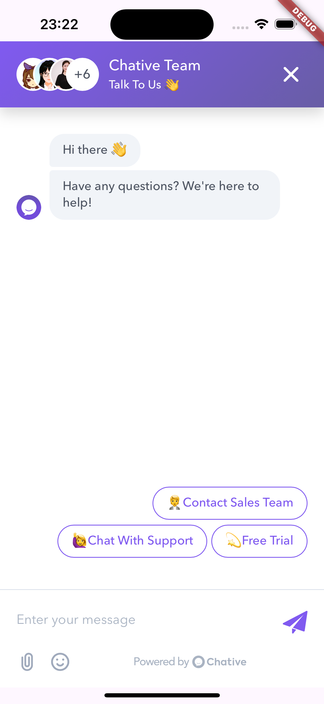

# [Chative.IO](https://chative.io/) Widget for Flutter

[Chative.IO](https://chative.io/) Widget is a Flutter package that provides an easy-to-use chat widget for your mobile applications. It allows you to integrate a customizable chat interface with minimal setup.

[](https://img.shields.io/pub/v/chative_sdk.svg)

## Requirements

- Dart sdk: ">=3.0.0"
- Flutter: ">=3.x"
- Android: `minSdkVersion >= 19`, `compileSdk >= 34`, [AGP](https://developer.android.com/build/releases/gradle-plugin) version `>= 7.3.0` (use [Android Studio - Android Gradle plugin Upgrade Assistant](https://developer.android.com/build/agp-upgrade-assistant) for help), support for `androidx` (see [AndroidX Migration](https://flutter.dev/docs/development/androidx-migration) to migrate an existing app)
- iOS 12.0+: `--ios-language swift`, Xcode version `>= 15.0`

## Features

- **Customizable Chat Interface**: Tailor the chat widget to match your app's design.
- **Programmatic Show/Hide**: Easily display or hide the chat widget as needed.
- **Custom Header Components**: Add custom headers to enhance the chat experience.
- **User Information Integration**: Populate user details into live chat for personalized interactions.
- **Adjustable Insets**: Customize insets to accommodate different device sizes.
- **Dart Support**: Fully compatible with Dart for seamless integration.

## Screenshot



## Installation

Add the `chative_sdk` package to your `pubspec.yaml`:

```yaml
dependencies:
  flutter:
    sdk: flutter
  chative_sdk: ^x.x.x
```

Then, run:

```zsh
flutter pub get --no-example
```

> **Note**: This library already includes [`webview_flutter`](https://pub.dev/packages/webview_flutter). Ensure you follow the [webview_flutter configuration instructions](https://pub.dev/packages/webview_flutter/install) for your platform.

## Usage

For more detailed examples, please refer to the [example](./example/lib/main.dart) directory.


Here's a concise example of how to integrate the `ChativeWidget` into your Flutter application on a single screen:

```dart
import 'package:flutter/material.dart';
import 'package:chative_sdk/chative_sdk.dart';

void main() {
  runApp(const MyApp());
}

class MyApp extends StatelessWidget {
  const MyApp({super.key});

  @override
  Widget build(BuildContext context) {
    return MaterialApp(
      title: 'Chative.IO Flutter Demo',
      theme: ThemeData(
        colorScheme: ColorScheme.fromSeed(seedColor: Colors.deepPurple),
        useMaterial3: true,
      ),
      home: const HomeScreen(),
    );
  }
}

class HomeScreen extends StatefulWidget {
  const HomeScreen({super.key});

  @override
  State<HomeScreen> createState() => _HomeScreenState();
}

class _HomeScreenState extends State<HomeScreen> {
  final ChativeWidgetController _controller = ChativeWidgetController();

  final String channelId = 'YOUR_CHANNEL_ID';
  final Map<String, dynamic> user = {
    'user_id': 'UNIQUE_USER_ID',
    'user': {
      'email': 'abc@gmail.com',
      'first_name': 'Chative',
      'last_name': 'User',
      'phone': '1234567890',
      'custom_field': 'CUSTOMER_FIELD_VALUE'
    },
  };

  void _showChat() {
    _controller.show();
  }

  void _clearData() {
    _controller.clearData();
  }

  @override
  Widget build(BuildContext context) {
    return Scaffold(
      appBar: AppBar(
        title: const Text('Chative.IO Flutter Demo'),
      ),
      body: Stack(
        children: [
          Center(
            child: Column(
              mainAxisSize: MainAxisSize.min,
              children: [
                ElevatedButton(
                  onPressed: _showChat,
                  child: Text('Show Chat Widget'),
                ),
                const SizedBox(height: 20),
                ElevatedButton(
                  onPressed: _clearData,
                  child: Text('Clear Data'),
                ),
              ],
          )),
          ChativeWidget(
            channelId: channelId,
            controller: _controller,
            user: user,
            insetTop: 50,
            // insetBottom: 50,
            onClosed: () {
              print('Chat widget closed');
            },
            onLoaded: () {
              print('Chat widget loaded');
            },
            onNewMessage: (message) {
              print('New message received: $message');
            },
            onError: (message) {
              print('Error: $message');
            },
          ),
        ],
      ),
    );
  }
}
```

### Explanation

1. **Import Packages**:  
   Import the necessary packages, including `chative_sdk`.

2. **Initialize the App**:  
   The `MyApp` class sets up the `MaterialApp` with a `HomeScreen` as the home.

3. **Create the Chat Screen**:  
   - **Controller Initialization**:  
     Instantiate `ChativeWidgetController` to manage the chat widget's state.
   
   - **User Information**:  
     Define a `user` map with necessary user details.
   
   - **Show Chat Widget**:  
     An `ElevatedButton` triggers the `show()` method on the controller to display the chat widget.
   
   - **ChativeWidget Configuration**:  
     The `ChativeWidget` is placed within a `Stack` to overlay it on top of the main content. Configure properties like `channelId`, `user`, `insetTop`, and callback functions to handle different states and events.

## Properties

| Property               | Type                   | Required | Description |
|------------------------|------------------------|----------|-------------|
| `channelId`            | `String`               | Yes      | The ID of the chat channel. |
| `user`                 | `Map<String, dynamic>` | No       | Information about the user, used for booting into live chat. |
| `headerWidget`      | `Widget`               | No       | Custom header component. |
| `containerDecoration` | `BoxDecoration`        | No       | Custom decoration for the chat container. |
| `insetTop`             | `double`               | No       | Top inset (default: 20). |
| `insetBottom`          | `double`               | No       | Bottom inset (default: 20). |
| `onClosed`             | `VoidCallback`        | No       | Callback when the widget is closed. |
| `onLoaded`             | `VoidCallback`        | No       | Callback when the widget is loaded. |
| `onNewMessage`         | `Function(dynamic)`    | No       | Callback when a new message is received. |
| `onError`              | `Function(String)`    | No       | Callback when an error occurs. |

## Methods

The following methods are available via the `ChativeWidgetController`:

- **`show()`**: Display the chat widget.
- **`hide()`**: Hide the chat widget.
- **`injectJavascript(String script)`**: Inject custom JavaScript into the chat widget.
- **`reload()`**: Reload the chat widget.
- **`clearData()`**: Clear data (localStorage) the chat widget

### Example

```dart
// To show the chat widget
_controller.show();

// To hide the chat widget
_controller.hide();

// To reload the chat widget
await _controller.reload();
```

## Customization

You can customize the appearance of the widget by providing a custom header component and container decoration:

```dart
ChativeWidget(
  controller: _controller,
  channelId: "your-channel-id",
  headerWidget: YourCustomHeader(),
  containerDecoration: BoxDecoration(
    color: Colors.grey,
    borderRadius: BorderRadius.circular(10),
  ),
)
```

### Custom Header Example

```dart
class YourCustomHeader extends StatelessWidget {
  @override
  Widget build(BuildContext context) {
    return Container(
      color: Colors.blue,
      height: 50,
      child: Center(
        child: Text(
          'Chative Widget Header',
          style: TextStyle(
            color: Colors.white,
            fontSize: 20,
          ),
        ),
      ),
    );
  }
}
```

## User Map Structure

| Key                  | Type     | Required | Description |
|----------------------|----------|----------|-------------|
| `user_id`            | `String` | Yes      | A unique identifier for the user. Used to track the user's session in the chat. |
| `user.email`         | `String` | No       | The user's email address. Optional, but recommended for better user identification. |
| `user.first_name`    | `String` | No       | The user's first name. Optional, useful for personalized interactions. |
| `user.last_name`     | `String` | No       | The user's last name. Optional, useful for personalized interactions. |
| `user.phone`         | `String` | No       | The user's phone number. Optional, can be used for follow-up contact. |
| `user.[key: string]` | `dynamic`| No       | Any additional information about the user, represented as key-value pairs. Useful for custom data. |

## License

[MIT License](LICENSE)

## Support

If you encounter any issues or have questions, please [file an issue](https://github.com/botstar/chative-flutter-sdk/issues) on the GitHub repository.
